## 1

在总公司的DCFW根据题意配置Trust,Untruct,VPNhub区域，并配置区域之间的放行策略；

**配置区域**

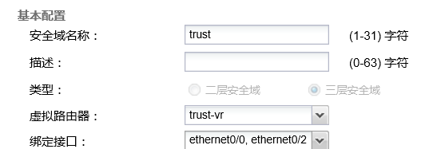

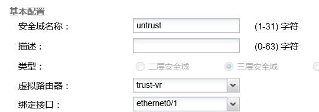

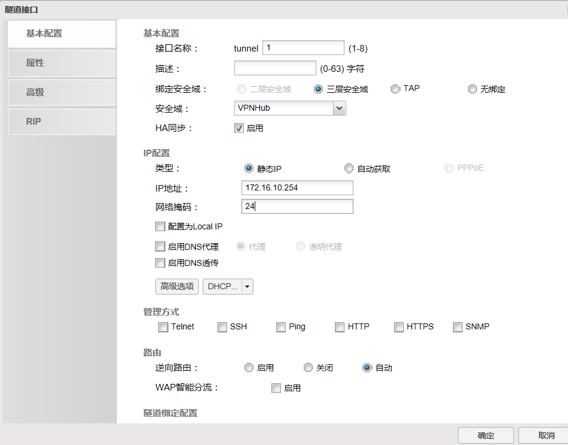

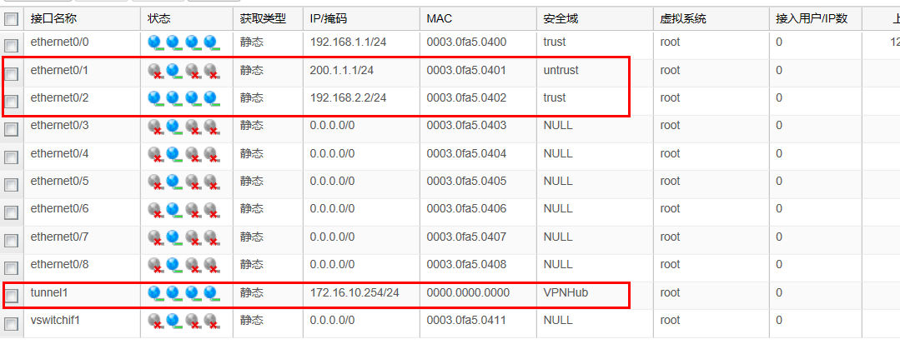

**放行策略配置** 

**内网和外网**

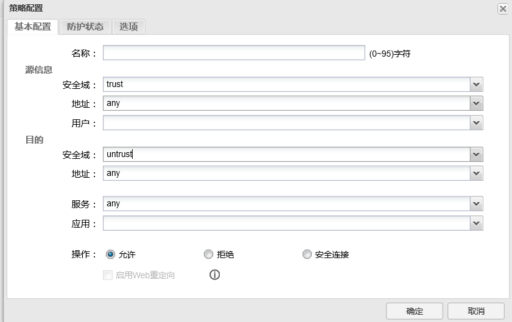

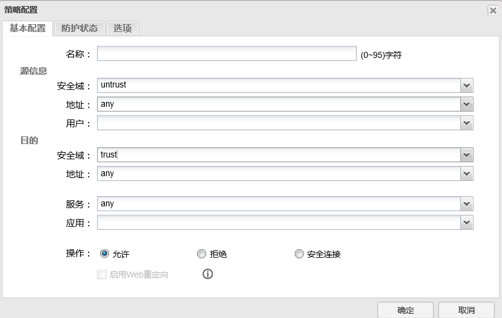

**VPN与内网之间**

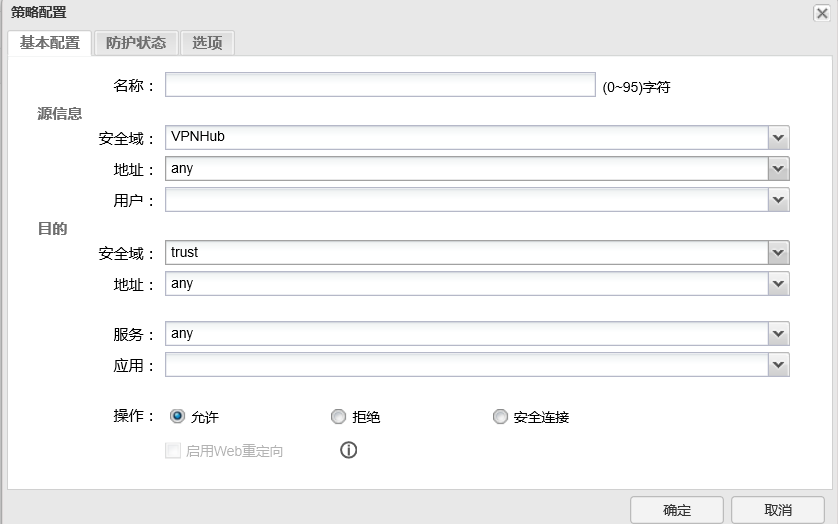

## 2

配置路由，通往internet的方向配置默认路由，使用下一跳IP为PC2,通往内部路由配置静态主类汇总路由；

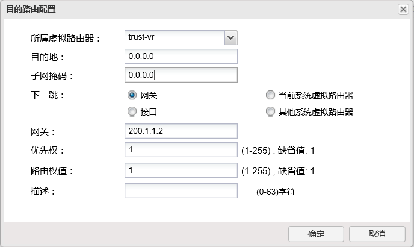

**内网路由：**

去日志服务器

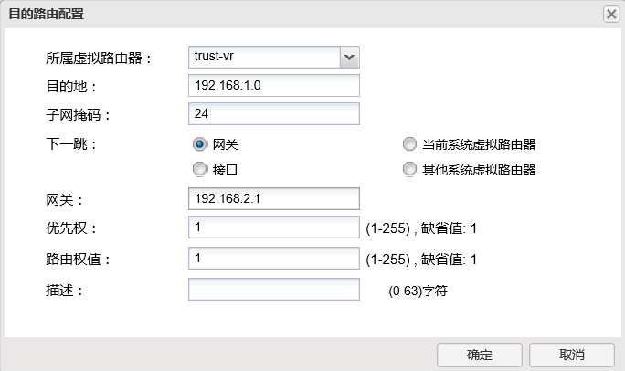

去PC1

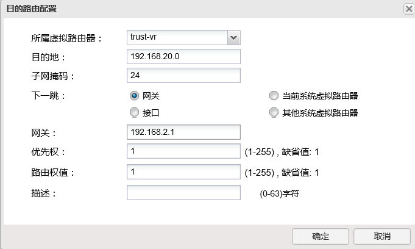

去PC3

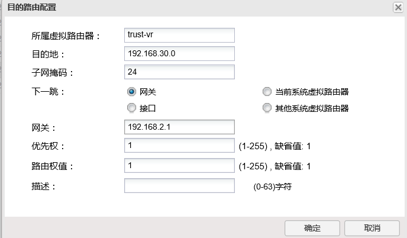

去DCWS：

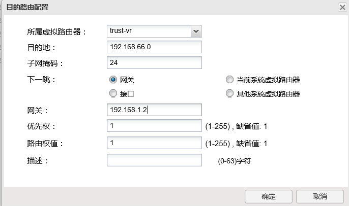

去WAF

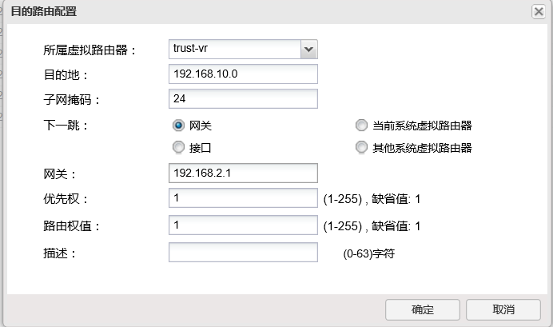

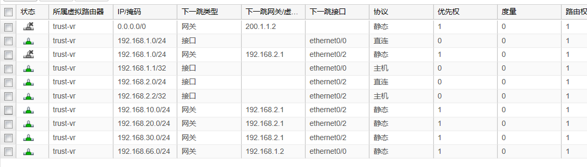

## 3

配置动态NAT，对应关系如下：
VLAN20用户映射为200.1.1.20；
VLAN30用户映射为200.1.1.30；

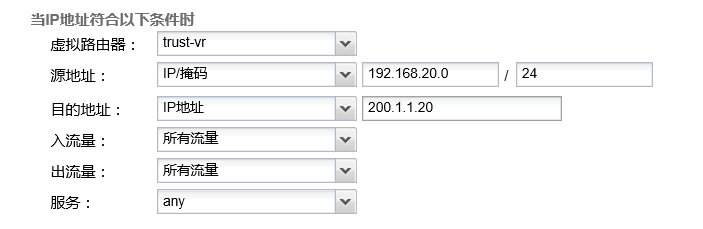

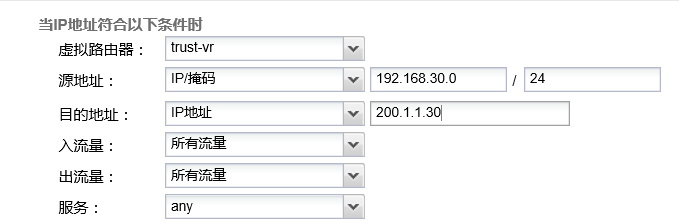

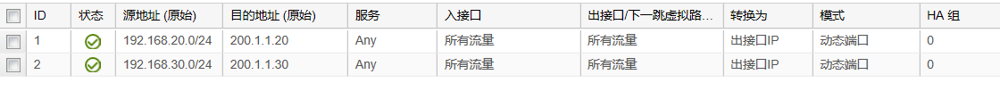

## 4

DCFW连接Internet的区域上配置以下攻击防护： 
启以下Flood防护：
ICMP洪水攻击防护，警戒值2000，动作丢弃；
UDP供水攻击防护，警戒值1500，动作丢弃；
SYN洪水攻击防护，源警戒值5000，目的警戒值基于IP 2000，动作丢弃；
开启以下DOS防护：
Ping of Death攻击防护；
Teardrop攻击防护；
IP选项，动作丢弃；
ICMP大包攻击防护，警戒值2048，动作丢弃；

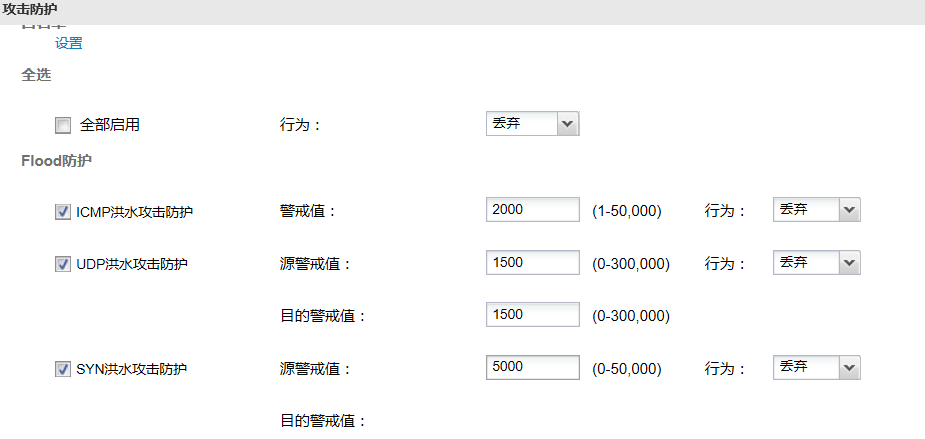

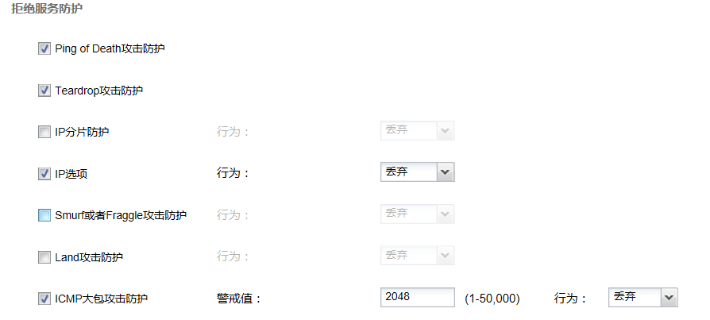

## 5

总公司DCFW配置SSLVPN，建立用户dcn01，密码dcn01，要求连接Internet PC2可以拨入，服务端口为9998，SSLVPN地址池参见地址表； 

建立用户：

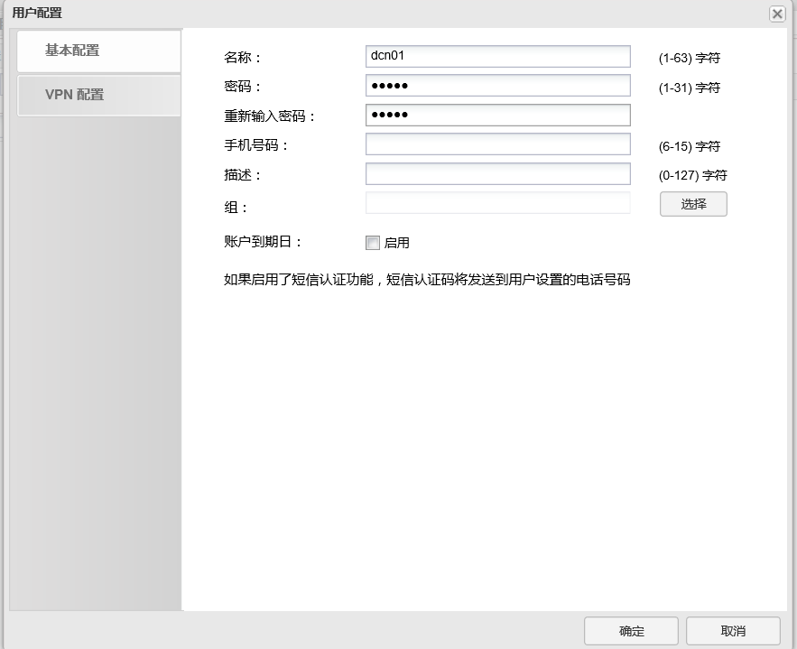

SSL配置：

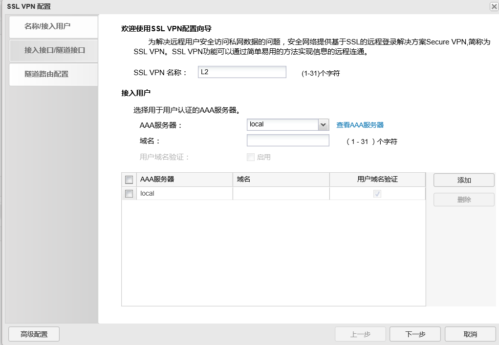

添加VPN地址池

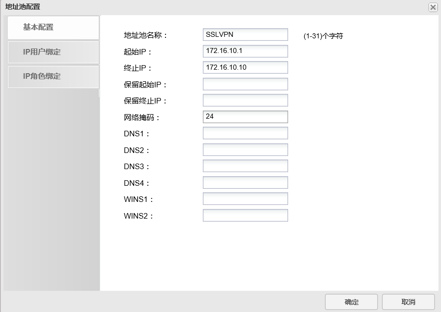

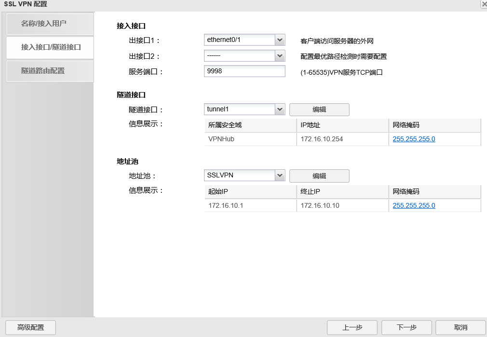

