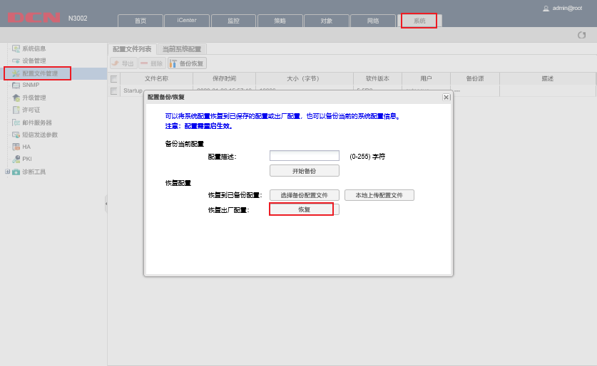
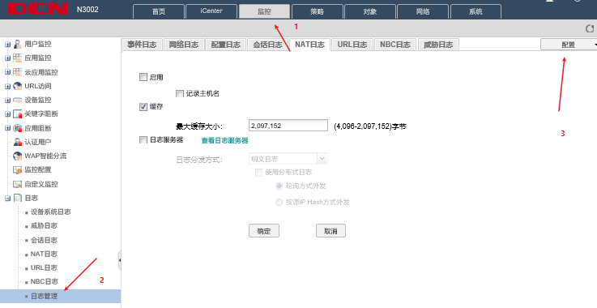
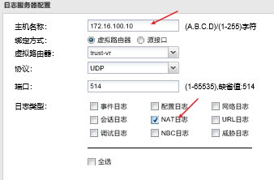
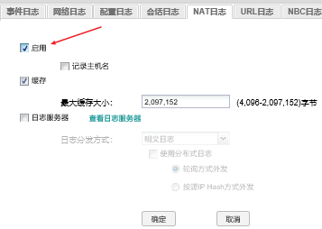

## 设备名称

DCRS - 交换机

RCWS - 无线控制器AC

DCBI - 日志

WAF - WEB防火墙

DCFW - 防火墙

DCST - 堡垒

## 设备重置

### DCRS&DCWS

``` shell
hostname#set default
hostname#write
hostname#reload
```

### DCFW

系统>配置文件管理>备份恢复




--------------------------


##  实验笔记

- DCRS的配置
	1. VLAN
		- 根据地址池创建vlan
		- 添加vlan网关
		- 端口模式：
				1.与其他设备使用access
				2.与AC使用Trunk，保证不同VLAN之间的标签转发成功。
	2. 路由
		- 配置默认路由 下一跳扔给防火墙接口
		- 配置通往AC上面VLAN网关的路由


 - DCWS
	 1. VLAN
		 - 添加地址池上面的VLAN，以及配置VLAN网关
		 - 与DCRS的直连接口修改为Trunk
	2. 路由
		 - 配置默认路由，下一跳扔给三层交换机接口
		

-	DCFW
	- 接口
			1. 根据地址池配置接口IP
	- 路由
			1. 配置默认路由，下一跳扔给三层交换机
			2. 配置外网路由，下一跳扔给218.路由（不确定）
			3. 根据地址池配置dmz区域通往netlog


### 问题汇总
- ①堡垒机接口IP，地址池并没有给，如何实现与PC3互通
  - 堡垒不需要ip
- ②DCWS的DHCP配置
  - 熟练
- ③DCFW的VPN标准配置
  - 加强
- ④三层交换机上面的无线1和无线2，不理解
  - 与dhcp同用


###  已实现
- 实现除DCST之外的全网互通（√）

# 注意点

* AP默认ip是192.168.1.10

# dhcp配置

首先需要在交换机上配置好相应的vlan、ip配置具体以题目为准，这里假设单纯在AC上配置dhcp 

！注意此处为单个无线，还有两个无线与帧中继的情况

vlan10: 192.168.10.254/24

vlan 100: 192.168.100.254/24

AP获取的ip为: 192.168.10.0/24

用户获取的ip是: 192.168.100.0/21

``` shell
(config)#vlan 10, 100
(config)#inter vlan 10
(config-if-vlan10)#ip add 192.168.10.254 255.255.255.0
(config-if-vlan10)#inter vlan 100
(config-if-vlan100)#ip add 192.168.100.254 255.255.255.0
(config)#inter e1/0/2
(config-if-ethernet1/0/2)#sw mo trunk
// 这里配置本征vlan是给ap使用的地址
(config-if-ethernet1/0/2)#sw trunk native vlan 10
// 开启dhcp服务！！！重要
(config)#server dhcp
// 这里的ap为这个地址池的名字
(config)#ip dhcp pool ap
// 地址池添加
(dhcp-ap-config)#network-address 192.168.10.0 255.255.255.0
// 网关设置
(dhcp-ap-config)#default-router 192.168.10.254
(config)#ip dhcp pool vlan100
(dhcp-ap-config)#network-address 192.168.100.0 255.255.255.0
(dhcp-ap-config)#default-router 192.168.100.254
(dhcp-ap-config)#dns-server 8.8.8.8
// 查看ac的ip获取，这一步可以跳过（有把握的话），也可以先去做其他的部分
#show ip dhcp binding
// 查看ap的硬件类型，ap的型号在机器后面查看，对应序号即可
#show vendor
(config)#wireless
// 关闭自动选取功能
(config-wireless)#no auto-ip-assign
// 认证方式
(config-wireless)#authentication none
// 指定发现vlan，这里的vlan为管理vlan
(config-wireless)#discovery vlan-list 10
// 开启无线功能
(config-wireless)#enable
// 查看是否成功，成功则会显示Managed Success
#show wireless ap sta
(config)#wireless
(config-wireless)#network 1
// 设置无线的ssid为admin
(config-network)#ssid admin
// 设置密文认证模式为wpa
(config-network)#security mode wpa-personal
// 设置用户获取vlan
(config-network)#vlan 100
// 配置wpa密码，长度至少为8位
(config-network)#wpa key 12345678
(config-wireless)#exit
// 即使是两个无线默认都使用1即可
(config-wireless)#ap profile 1
// 此处的29为ap的硬件类型，上面有提及，对应序号即可
(config-ap-profile)#hwtype 29
// 应用
#wireless ap profile apply 1
// 如果成功则会与上面相同
#show wireless ap status
// ---其他的配置----
(config)#wireless
(config-wireless)#network 1
// 隐藏SSID
(config-network)#hide-ssid
// 流控
(config-network)#client-qos enable
// 设置下载速度为2m，即2048
(config-network)#client bandwidth-limit down 2048
// 设置上载速度为1m，即1024
(config-network)#client bandwidth-limit up 1024
(config-network)#exit
// 设置AC断开网络时AP还能正常工作
(config-wireless)#ap profile 1
(config-ap-profile)#ap escape
// 配置2.4频段下工作使用802.11g
(config--ap-profile)#radio 1
(config--ap-profile)#mode g
// 通过黑名单技术禁止某mac通过无线上网
(config-wireless)#mac-authentication-mode black-list
(config-wireless)#known-client 68-a3-c4-e6-a1-be action deny
(config)#
```

### 帧中继

一般帧中继会在DCRS上做，DHCP在DCWS上，用户获取ip过程为：AP>DCWS(ip找RS)>DCRS(找DHCP)>DCWS(给予ip)>DCRS(转发给AP)>DCWS(转发给AP)>AP

#### DCSW

``` shell
// 在DCSW上的dhcp配置使其
(config)#ip forward-protocol udp bootps
```

[](note.assets/两个无线/帧中继/AC.text )

#### DCRS

``` shell
// 在DCRS上配置
(config)#int vlan 10
(config-if-vlan10)# ip helper-address 192.168.10.254
```

[](note.assets/两个无线/帧中继/RS.text )

### 两个无线（非帧中继的模拟题）

出现两个无线这种情况的话你将需要用到两个network，两个network都对应一个ap profile 1里面的radio1和radio2，切记要开启(enable)他们的vap1

为了防止弄错下面贴上配置

#### DCWS

[](note.assets/两个无线/模拟题/AC.text )

#### DCRS

[](note.assets/两个无线/模拟题/RS.text )

注：此配置中交换机与无线控制器任务2中是有几道题目是错误的，所以参考无线的配置即可

# 命令

## DCRS
### 配置环路检测时间

配置存在环路时的检测时间间隔为30秒，不存在环路时的检测时间间隔为10秒

hostname(config)# loopback-detection interval-time 30 10

### 限制端口学习MAC

为终端产生防止 MAC 地址防洪攻击，请配置端口安全，
已划分 VLAN 的端口最多学习到 5 个 MAC 地址，发生违规阻止后续违规流量
通过，不影响已有流量并产生 LOG 日志；

``` shell
// 限制学习到5个MAC
(config-if-ethernet1/0/1)#switchport port-security
(config-if-ethernet1/0/1)#switchport port-security maximum 5
(config-if-ethernet1/0/1)#switchport port-security violation restrict
(config-if-ethernet1/0/2)#sw port
(config-if-ethernet1/0/2)#sw port max 5
(config-if-ethernet1/0/2)#sw port v rest
...
```

连接 PC1 的接口为专用接口，限定只允许 PC1 的 MAC 地址可以连接；

``` shell
//限定PC1
(config-if-ethernet1/0/6)#switchport port-security
(config-if-ethernet1/0/6)#switchport port-security mac-address 9c-5c-8e-37-31-98
```


## DCFW

### 路由的配置

DCFW 配置 LOG，记录 NAT 会话， Server IP 为 172.16.100.10.开启 DCFW上 snmp 服务，Server IP 172.16.100.10 团体字符为 public5;

首先我们需要先新建一个日志服务器：找到监控>日志>日志管理>配置>日志服务器配置



​	新建：输入IP地址并勾选NAT日志



​	之后再勾选启用NAT日志




